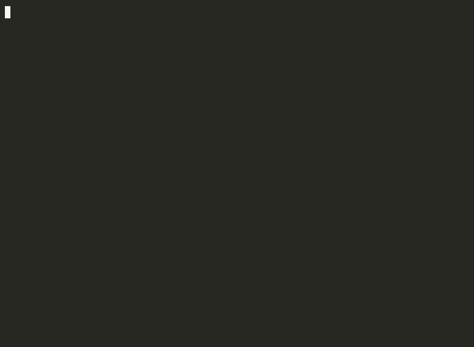

# xfreerdp Demo

This demo shows how ForestGump.sh can perform headless RDP connections from within a Docker container using `xfreerdp` and `xvfb-run`.



*Headless xfreerdp session connecting to an xrdp target from Docker*

## Architecture

```
┌─────────────────────┐         RDP (3389)        ┌─────────────────────┐
│   forestgump        │ ──────────────────────────>│   rdp-target        │
│                     │                            │                     │
│  - xfreerdp 2.11.5 │                            │  - Ubuntu 24.04     │
│  - xvfb (headless)  │                            │  - xrdp             │
│  - ttyd (web shell) │                            │  - openbox (WM)     │
│                     │                            │  - xterm            │
│  Port: 7681 (ttyd)  │                            │  Port: 3389 (RDP)   │
└─────────────────────┘                            └─────────────────────┘
         │                          │
         └──────── adlab network ───┘
```

- **forestgump** — the main pentesting container with xfreerdp installed
- **rdp-target** — a lightweight Linux RDP server (xrdp + openbox) for testing

## Prerequisites

- Docker and Docker Compose installed
- The repository cloned locally

## Quick Start

### 1. Build and start the demo environment

```bash
docker compose -f docker-compose.demo.yml up -d --build
```

This builds both images and starts them on a shared `adlab` bridge network.

### 2. Wait for xrdp to start (~3 seconds)

```bash
sleep 3
```

### 3. Run the demo script

**Full demo with live RDP connection:**

```bash
docker exec forestgump bash /opt/scripts/demo-xfreerdp.sh rdp-target demo demo
```

**Dry-run (no target, just validates the toolchain):**

```bash
docker exec forestgump bash /opt/scripts/demo-xfreerdp.sh
```

### 4. Expected output (full demo)

```
  ╔══════════════════════════════════════╗
  ║   ForestGump.sh - xfreerdp Demo     ║
  ╚══════════════════════════════════════╝

[1/4] Checking xfreerdp binary...
  [✓] xfreerdp found at /usr/bin/xfreerdp
[2/4] xfreerdp version:
This is FreeRDP version 2.11.5 (2.11.5)
  [✓] Version retrieved
[3/4] Checking xvfb-run (headless display)...
  [✓] xvfb-run available — headless RDP supported
[4/4] Connection test...
      Connecting to rdp-target as demo...
  [✓] RDP connection to rdp-target succeeded (session was active)
```

All four checks should show a green checkmark.

## What the demo validates

| Check | What it proves |
|-------|---------------|
| 1 — xfreerdp binary | The `freerdp2-x11` package is correctly installed |
| 2 — Version output | xfreerdp can execute inside the container via xvfb |
| 3 — xvfb-run available | Headless X11 virtual framebuffer is present |
| 4 — Live RDP connection | End-to-end RDP from forestgump to rdp-target works |

## How headless RDP works

Since the ForestGump container has no physical display, `xvfb-run` creates a virtual X11 framebuffer. The wrapper at `/opt/scripts/xfreerdp.sh` handles this automatically:

```bash
# Manual headless RDP connection:
xvfb-run --auto-servernum xfreerdp /v:TARGET /u:USER /p:PASS /cert:ignore
```

## Connecting to your own targets

From within the forestgump container, connect to any RDP host:

```bash
# Using the wrapper script (auto-detects headless):
/opt/scripts/xfreerdp.sh /v:192.168.1.10 /u:administrator /p:'P@ssw0rd' /cert:ignore

# Or use the demo script for a quick validation:
bash /opt/scripts/demo-xfreerdp.sh 192.168.1.10 administrator 'P@ssw0rd'
```

## Using the web terminal

The forestgump container exposes a web-based terminal via ttyd:

1. Open http://localhost:7681 in your browser
2. You get a root shell inside the container
3. Run any commands directly, including xfreerdp via the wrapper

## RDP target credentials

| User | Password |
|------|----------|
| demo | demo     |

## Cleanup

```bash
docker compose -f docker-compose.demo.yml down
```

## Troubleshooting

**xrdp not listening:** Wait a few seconds after container start — xrdp-sesman needs time to initialize.

**"Xvfb failed to start":** A stale lock file may exist. The `--auto-servernum` flag avoids this by picking an unused display number. If it persists, restart the container.

**Connection refused:** Ensure both containers are on the same network (`docker network ls` should show `forestgumpsh_adlab`).

## Files involved

| File | Purpose |
|------|---------|
| `docker-compose.demo.yml` | Compose file for the demo environment |
| `deploy/rdp-target/Dockerfile` | RDP target image (ubuntu + xrdp + openbox) |
| `scripts/demo-xfreerdp.sh` | Demo validation script (4 checks) |
| `scripts/xfreerdp.sh` | Headless xfreerdp wrapper |
| `Dockerfile` | Main ForestGump.sh image |
